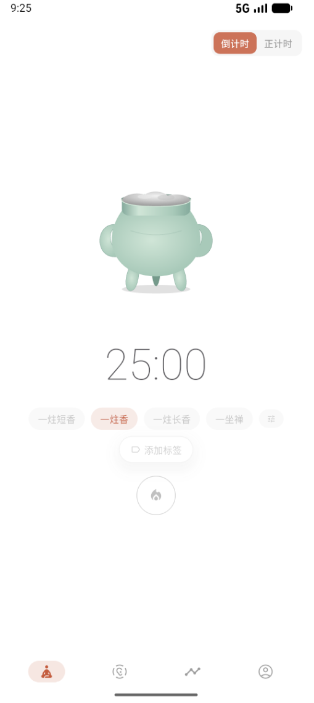
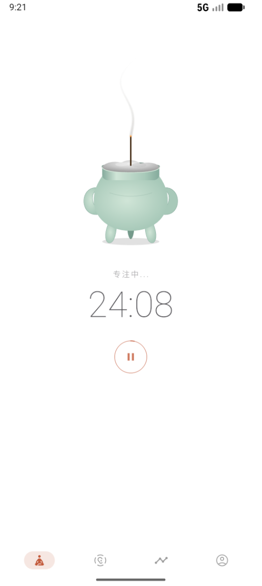
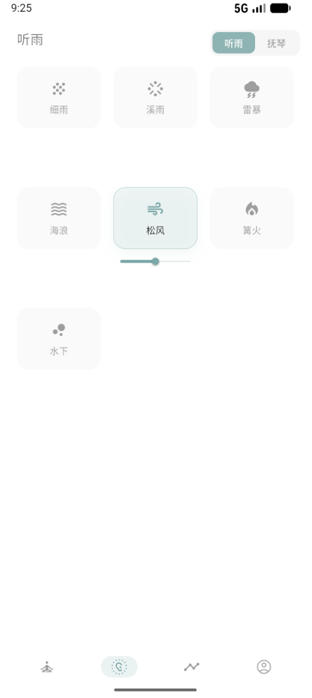
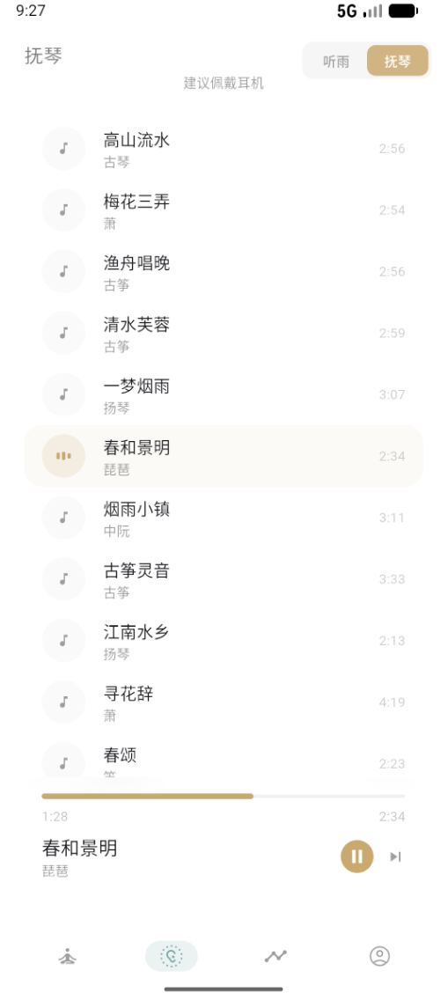
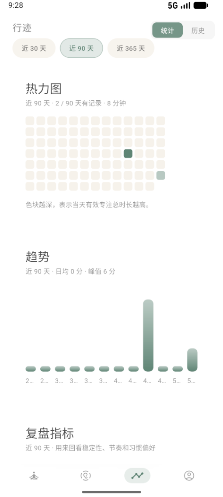
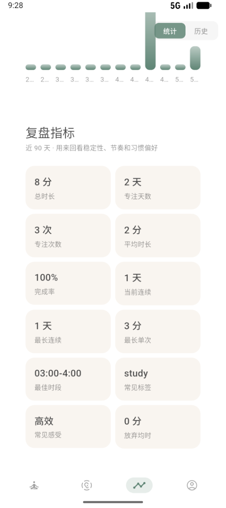
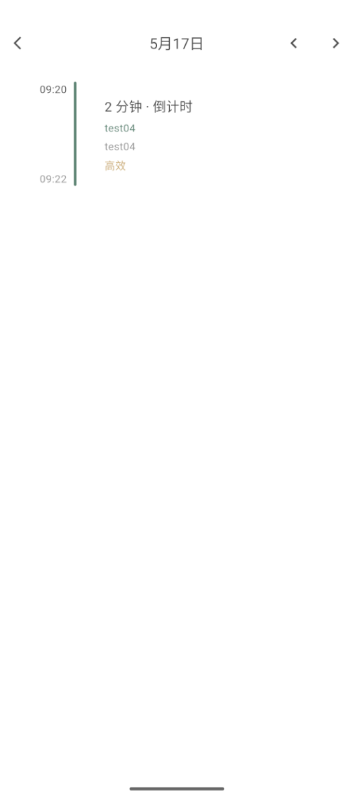
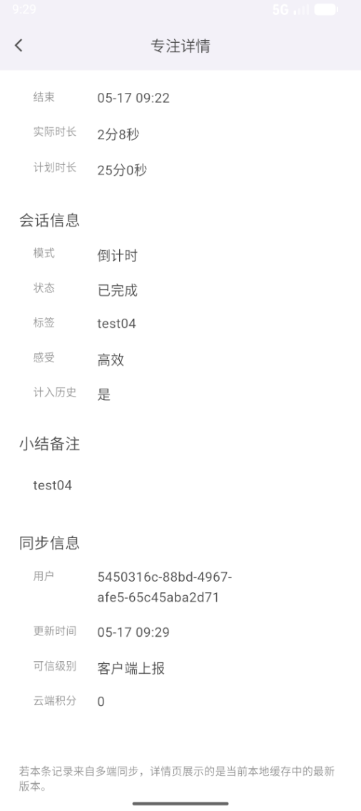
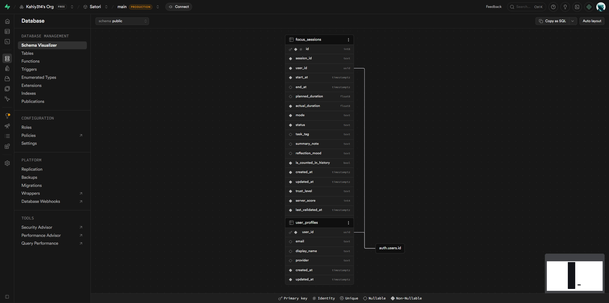
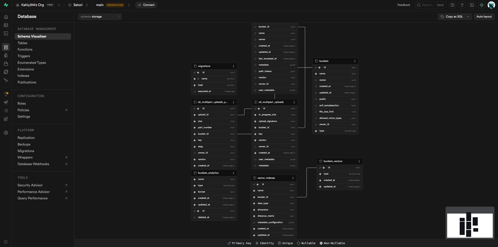

# Satori

Satori 是一个带有东方美学气质的专注应用项目。它以“焚香”为核心仪式，把专注计时、环境声、器乐、复盘记录、行迹统计和可选云同步收拢在一个安静、克制的使用流程里。

仓库目前包含两个实现：

- `satori_flutter`：Flutter 主应用，面向 Android / iOS / Web / Desktop 的跨平台版本。
- `satori_miniprogram`：微信小程序版本，由 AvAn0sch 协作开发，产品风格与 Satori 保持一致。

## 界面预览

### 焚香专注

<p>
  
  
</p>

### 听雨与抚琴

<p>
  
  
</p>

### 行迹统计

<p>
  
  
  
  
</p>

### Supabase 数据库 Schema

<p>
  
  
</p>

## 项目功能介绍

Satori 采用 local-first 设计：不配置 Supabase 时，Flutter 版仍然可以完整记录本地专注；配置 Supabase 后，可以开启邮箱账号、密码重置和 focus session 云端同步。

### 焚香：从开始到完成的专注仪式

焚香页是 Satori 的主入口。用户可以在倒计时和正计时之间切换，选择“一炷短香”“一炷香”“一炷长香”“一坐禅”等预设时长，也可以进入自定义时长。开始后，香炉进入燃香状态，页面只保留当前专注状态、剩余时间和暂停按钮，降低干扰。

一次专注结束后，应用会围绕这次 session 保存计划时长、实际时长、开始/结束时间、模式、完成状态、任务标签、小结备注和完成感受。过短或被放弃的记录可以被排除在行迹统计之外，避免污染长期数据。

### 听雨：白噪音声景

听雨页提供适合专注背景的环境声，包括细雨、溪雨、雷暴、海浪、松风、篝火、水下等声景。每个声景以简洁卡片呈现，选中后可直接调节音量。这个模块适合和焚香计时一起使用，也可以作为独立的环境声播放器。

### 抚琴：器乐播放

抚琴页提供古琴、箫、扬琴、琵琶、中阮、笛等器乐曲目列表。界面展示曲名、乐器类型和时长，底部播放条显示当前曲目、进度、播放/暂停与切歌控制。曲目更偏安静陪伴，适合阅读、写作和长时间整理。

### 行迹：专注数据复盘

行迹页分为统计与历史两个视角。统计视角支持近 30 天、近 90 天、近 365 天切换，包含热力图、趋势柱状图和复盘指标卡片。复盘指标会汇总总时长、专注天数、专注次数、平均时长、完成率、当前连续、最长连续、最长单次、最佳时段、常见标签、常见感受和放弃均时。

历史视角支持按日期查看单日时间线。每条记录展示时段、时长、计时模式、任务标签、备注和感受。进入专注详情后，可以查看更完整的会话信息，以及云同步相关字段，例如用户 ID、更新时间、可信级别和云端积分。

### 账号与云同步

云同步由 Supabase 提供，属于可选能力。启用后，用户可以通过邮箱密码注册、登录、退出和重置密码。登录后，本地已完成的 focus session 会通过 RPC 上报到 Supabase，远端记录也会回拉到本地缓存。

后端核心表包括：

- `public.user_profiles`：保存用户资料、邮箱、展示名、登录 provider 和时间戳。
- `public.focus_sessions`：保存专注记录，包含 `session_id`、`user_id`、`start_at`、`end_at`、`planned_duration`、`actual_duration`、`mode`、`status`、`task_tag`、`summary_note`、`reflection_mood`、`is_counted_in_history`、`trust_level`、`server_score` 等字段。

写入不依赖客户端直接操作表，而是通过 Supabase RPC 与 RLS 控制边界。未登录或网络不可用时，应用继续写入本地缓存；同步恢复后再合并数据。

### 微信小程序

微信小程序版本提供任务管理、番茄计时、日历打卡、统计面板、古文名言弹窗和设置页。它与 Flutter 版保持相近的产品气质，但目前 Flutter focus sessions 和小程序 pomodoro records 仍是两套本地数据模型，暂未建立共享同步协议。

## 技术栈

- Flutter：Dart、Riverpod、Material 3、shared_preferences、Supabase Flutter、just_audio / audioplayers、in_app_purchase。
- 微信小程序：TypeScript、WXML、WXSS、微信开发者工具、本地存储。
- 后端服务：Supabase Auth、Postgres、RLS、RPC。云同步是可选能力，未配置时 Flutter 版会自动退回本地模式。
- 文档与交付：MIT 代码许可证、GitHub Actions Flutter CI、独立资产许可说明。

## Quick Start

### 1. 准备 Flutter 依赖

```powershell
cd D:\Code\Satori\satori_flutter
flutter pub get
```

如果你不是在这个仓库的本机路径下运行，把 `D:\Code\Satori` 替换成自己的仓库路径即可。

### 2. 运行 Flutter 本地模式

本地模式不需要 Supabase 配置，专注记录会保存在当前设备本地。

```powershell
cd D:\Code\Satori\satori_flutter
flutter run
```

也可以先构建 debug APK，再安装到指定 Android 设备：

```powershell
cd D:\Code\Satori\satori_flutter
flutter build apk --debug
adb devices
adb -s <device-id> install -r build\app\outputs\flutter-apk\app-debug.apk
```

例如设备 ID 是 `5e24c2e8`：

```powershell
cd D:\Code\Satori\satori_flutter
flutter build apk --debug
adb -s 5e24c2e8 install -r build\app\outputs\flutter-apk\app-debug.apk
```

### 3. 运行 Flutter 云同步模式

先复制本地 Supabase 配置文件：

```powershell
cd D:\Code\Satori\satori_flutter
copy tool\supabase.local.example.json tool\supabase.local.json
```

然后编辑 `tool\supabase.local.json`，填入：

```json
{
  "SUPABASE_URL": "https://your-project.supabase.co",
  "SUPABASE_PUBLISHABLE_KEY": "your-publishable-key",
  "SUPABASE_AUTH_REDIRECT_URL": "satori://auth/callback"
}
```

在 Supabase 控制台中，需要启用 Email provider，并把下面的地址加入 `Authentication -> URL Configuration -> Redirect URLs`：

```text
satori://auth/callback
```

连接设备直接运行：

```powershell
cd D:\Code\Satori\satori_flutter
flutter run -d <device-id> --dart-define-from-file=tool/supabase.local.json
```

或者构建云同步 debug APK 后安装：

```powershell
cd D:\Code\Satori\satori_flutter
flutter build apk --debug --dart-define-from-file=tool/supabase.local.json
adb -s <device-id> install -r build\app\outputs\flutter-apk\app-debug.apk
```

使用设备 `5e24c2e8` 的例子：

```powershell
cd D:\Code\Satori\satori_flutter
flutter build apk --debug --dart-define-from-file=tool/supabase.local.json
adb -s 5e24c2e8 install -r build\app\outputs\flutter-apk\app-debug.apk
```

### 4. 构建 Android release 包

生产构建建议使用 `tool\supabase.production.json` 注入配置：

```powershell
cd D:\Code\Satori\satori_flutter
flutter build apk --release --dart-define-from-file=tool/supabase.production.json
```

公开仓库没有内置 Android release signing。直接安装 release APK 前，请先在本地配置 keystore、`android/key.properties` 和 Gradle signingConfig。完成签名后再安装：

```powershell
cd D:\Code\Satori\satori_flutter
adb -s <device-id> install -r build\app\outputs\flutter-apk\app-release.apk
```

如果没有配置 release 签名，请优先使用上一节的 debug APK 做真机冒烟测试。

### 5. 运行微信小程序

```powershell
cd D:\Code\Satori\satori_miniprogram
npm install
npm run typecheck
```

然后在微信开发者工具中打开 `satori_miniprogram`。公开仓库里的 `project.config.json` 使用 `touristappid`，本地调试或发布时请在微信开发者工具里换成你自己的 AppID。

更多说明见：

- [Flutter 开发说明](docs/development.md)
- [架构说明](docs/architecture.md)
- [Supabase 配置](docs/supabase.md)
- [微信小程序说明](docs/miniprogram.md)
- [发布说明](docs/release.md)

## 常见问题

**不配置 Supabase 能不能跑？**

可以。Flutter 版默认支持本地模式，账号入口会显示“云同步未配置 / 本地模式”，专注记录会保存在本地。

**真机测试过吗？**

已在 Huawei Android 真机上通过 debug APK 做过基础冒烟测试。未注入 Supabase 配置的 APK 会进入本地模式，焚香、白噪音、基础行迹记录等离线能力可用；账号创建、登录和云同步需要重新构建带 Supabase 配置的 APK。

**能不能用 `adb install` 时再接上 Supabase？**

不能。`adb install` 只安装已经构建好的 APK，Supabase 配置需要在 `flutter build` 或 `flutter run` 阶段通过 `--dart-define-from-file` 注入。详见 [发布说明](docs/release.md)。

**为什么 release signing 没有内置？**

Android release 签名、iOS Team ID、App Store / Google Play 配置都属于本地发布材料，不应进入公开仓库。配置方式见 [发布说明](docs/release.md)。

**这个仓库现在适合直接商用上架吗？**

代码层面可以继续打磨，但音频和部分图片资源需要先完成授权核验或替换，见下方 Asset License。

## Asset License

本仓库代码使用 [MIT License](LICENSE)。除非在 [Asset License](docs/assets.md) 中明确列入可再分发清单，`assets/`、`miniprogram/assets/`、`docs/images/` 下的图片、SVG、音频、截图和生成图不自动适用 MIT License。

当前资产来源包含 AI 生成/二次编辑素材、网络可商用音频和从视频转出的音频，其中一部分尚未完成源头授权核验。公开发布、商店上架或商业使用前，请替换未核验音频，或补齐可追溯的许可证与来源记录。
